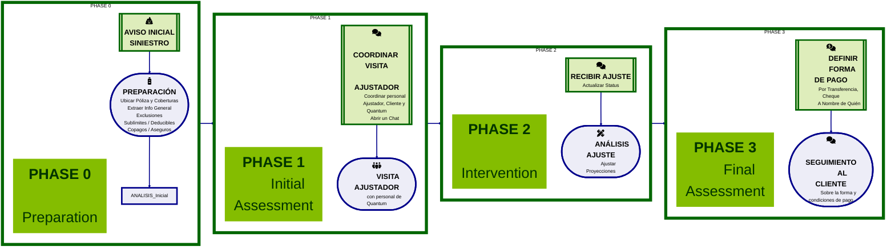

```mermaid
%%{
  init: {
    'theme': 'base',
    'themeVariables': {
        'lineColor': 'darkblue',
        'primaryColor': '#DFEEBD',
        'primaryTextColor': 'black',
        'primaryBorderColor': '#006600',
        'tertiaryColor': 'white',
        'edgeLabelBackground': 'white'
    }
  }
}%%

flowchart LR
    subgraph CICLOI ["PHASE 0"]
    %% Componentes CICLO I
        CICLOI_title["<span style='font-size: xxx-large;'><b>PHASE 0</b>
        Preparation</span>"]
        AVISO[["
            <span style='font-size: x-large;'>fa:fa-poo
            <b>AVISO INICIAL 
            SINIESTRO</b>
            </span>"]]
        PREPARACION(["
            <span style='font-size: x-large;'>fa:fa-bottle-water
            <b>PREPARACIÓN</b></span>
            Ubicar Póliza y Coberturas
            Extraer Info General
            Exclusiones
            Sublímites / Deducibles
            Copagos / Aseguros"])
    %% Relaciones CICLO I
        AVISO --> PREPARACION
        PREPARACION --> ANALISIS_Inicial
    end

    subgraph CICLOII ["PHASE 1"]
        CICLOII_title["<span style='font-size: xxx-large;'><b>PHASE 1</b>
        Initial Assessment</span>"]
        %% Componentes
        COORDINAR_Visita_Ajustador[["
            <span style='font-size: x-large;'>fa:fa-comments
            <b>COORDINAR VISITA
            AJUSTADOR</b></span>
            Coordinar personal
            Ajustador, Cliente y Quantum
            Abrir un Chat
            "]]
        VISITA_Ajustador(["
            <span style='font-size: x-large;'>fa:fa-people-group
            <b>VISITA AJUSTADOR</b></span>
            con personal de Quantum
            "])
        %% Relaciones CICLO II
        COORDINAR_Visita_Ajustador --> VISITA_Ajustador
    end

    subgraph CICLOIII ["PHASE 2"]
        CICLOIII_title["<span style='font-size: xxx-large;'><b>PHASE 2</b>
        Intervention</span>"]
        %% Componentes
        RECIBIR_Ajuste[["
            <span style='font-size: x-large;'>fa:fa-comments
            <b>RECIBIR AJUSTE</b></span>
            Actualizar Status
            "]]
        ANALISIS_Ajuste(["
            <span style='font-size: x-large;'>fa:fa-pen-ruler
            <b>ANÁLISIS AJUSTE</b></span>
            Ajustar Proyecciones
            "])
    %% Relaciones CICLO III
        RECIBIR_Ajuste --> ANALISIS_Ajuste
    end

    subgraph CICLOIV ["PHASE 3"]
        CICLOIV_title["<span style='font-size: xxx-large;'><b>PHASE 3</b>
        Final Assessment</span>"]
        %% Componentes
        DEFINIR_Pago[["
            <span style='font-size: x-large;'>fa:fa-comments-dollar
            <b>DEFINIR
            FORMA DE PAGO</b></span>
            Por Transferencia, Cheque
            A Nombre de Quién
            "]]
        SEGUIMIENTO_Cliente(["
            <span style='font-size: x-large;'>fa:fa-comments
            <b>SEGUIMIENTO
            AL CLIENTE</b></span>
            Sobre la forma y condiciones de pago
            "])
    %% Relaciones CICLO IV

         DEFINIR_Pago
         --> SEGUIMIENTO_Cliente
    end

%% RELACIONES CICLOS
    CICLOI ==> CICLOII ==> CICLOIII ==> CICLOIV

%% ESTILOS
    %% Nodos
        classDef default fill:#EDEDF7,stroke:darkblue,stroke-width:5px;
        classDef CICLOS stroke:#006600,stroke-width:10px;
        classDef CICLO_titles color:#003300,fill:#84bd00,stroke:none;
        classDef Inicios fill:#84bd0044,stroke:darkgreen,stroke-width:5px;
        classDef Finales fill:#F7EDED,stroke:darkred,stroke-width:5px;
        classDef Opcionales fill:#FFEDCC,stroke:darkorange,stroke-width:5px,stroke-dasharray:5 5;
        class CICLOI_title,CICLOII_title,CICLOIII_title,CICLOIV_title CICLO_titles
        class CICLOI,CICLOII,CICLOIII,CICLOIV CICLOS
        class AVISO,ENVIAR_Requerimientos_Cliente,COORDINAR_Visita_Ajustador Inicios
        class RECIBIR_Ajuste,DEFINIR_Pago Inicios
        class REGISTRO_Plataformas,ENVIAR_Ajustadores,ENVIAR_Ajuste_Final,REGISTRAR_Cierre Finales
        class SEGUIMIENTO_Ajustadores,SEGUIMIENTO_PostCierre Opcionales
    %% Líneas
        linkStyle default stroke-width:3px,stroke:darkblue;
```
